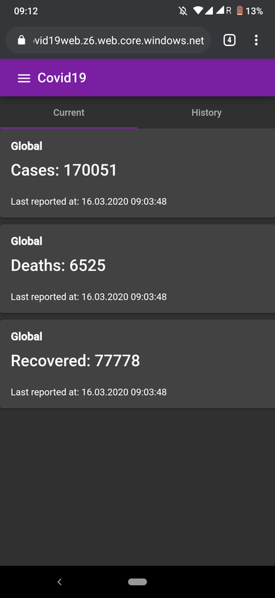
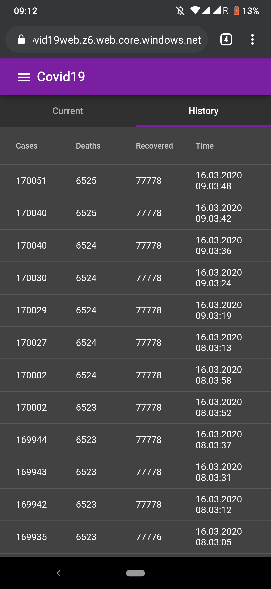

# COVID-19-Statistics

This web-application is showing historical data using the [Covid19Api](https://github.com/alsami/Covid-19-API).

The app is hosted on azure and can be found [here](http://app-covid-19-statistics.azurewebsites.net).

## Samples

### Global stats

